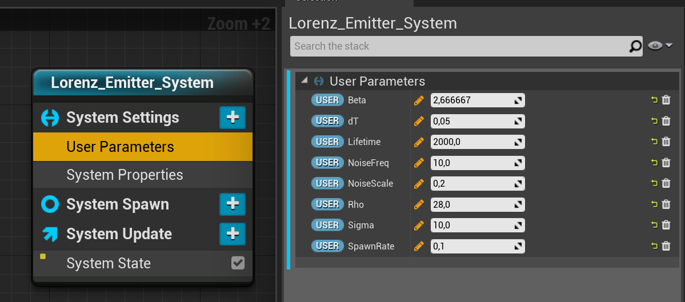
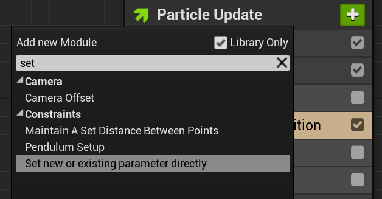
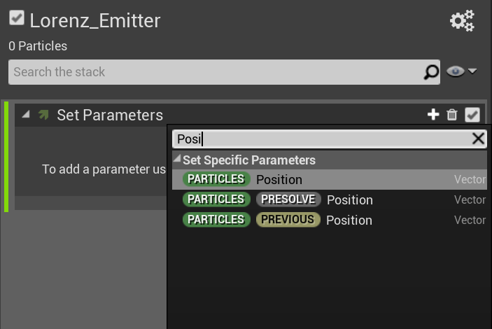
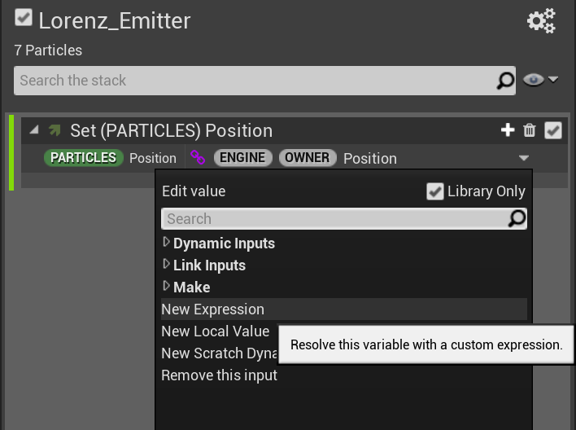

# Lorenz System using Niagara FX (Unreal Engine 4.26)

_This is not a tutorial on how to start work with Niagara FX, that knowledge is expected for this tutorial and can be learned [there](https://docs.unrealengine.com/en-US/RenderingAndGraphics/Niagara/QuickStart/index.html). This tutorial is about implementing Lorenz System using Niagara._

## What is Lorenz System? 

There are some math constructs which provide an interesting feature - if there is a point (anywhere) in a space and you apply some formulas to this point's coordinates then you'll get a new coordinate where you're moving the point. Thus, step by step any (almost) point will move to an area where it will be retained in closed orbit. That's how I understand strange attractors (and Lorenz System in particular). 

## Lorenz System with Niagara 

Unreal's FX system Niagara allows to create an effect based on Lorenz System. And it’s surprisingly easy. 

To be specific – it's just a matter of one module in “Particle Update” step in Niagara Emitter. There a particle position should be updated accordingly to the equations defined by Lorenz System. There are the equations: 

```
dx = Sigma*(y-x) 

dy = x*(Rho-z)-y 

dz = x*y-Beta*z
```

Where `Sigma`, `Rho` and `Beta` are constants (10, 28 and 8/3) and resulting vector [dx, dy, dz] is a direction to shift point from its current position. 

Given it’s possible to get current particle’s position with `Particle.Position` within `Set Parameter` module and custom HLSL expression you need to:

0. Create some properties: There I have some additional properties to control Curl Noise which gives some additional disturbance to overwise mathematically perfect particle trajectories. 

1. Add “Set new or existing parameter directly” to the Particle Update step  
2. Add “Position” to created “Set Parameters” module
3. Change particles position parameter value to ”New Expression”  
4. Replace the placeholder with this expression:
```
Particles.Position + (Particles.Random) * User.dT * Engine.DeltaTime * float3(User.Sigma*(Particles.Position.y-Particles.Position.x), User.Rho * Particles.Position.x-Particles.Position.y-Particles.Position.x * Particles.Position.z, Particles.Position.x * Particles.Position.y-User.Beta * Particles.Position.z)
```

What's left is to decide how this thing should look. For me there are two main options:
1. Trails - nice looking strands using Ribbon Render on a secondary emitter. Allows to use less particles, control colors along strands
2. Objects - use simple small low-poly spheres with Mesh Render. As meshes they works fine with DoF and motion blur (I was not able to make DoF effect to work fine with Ribbon Render)